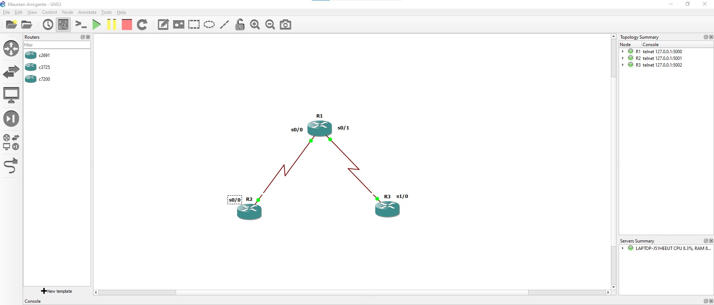

###

  <h1>First Topology </h1>

While studying for CCNA, I tried to create a basic topology using GNS3 without applying any configurations. I used ISOs c2691, c3725, and c7200. I had to start the router (turned on in simulation) and click Idle-PC so that my laptop would lower its utilization.

GNS3 (Graphical Network Simulator) is network emulator software used to design, build, and simulate complex networks. It allows users to create virtual network topologies and run various networking devices, including routers, switches, firewalls, and other network appliances. GNS3 uses real network operating systems such as Cisco IOS, Juniper JunOS, and others to provide a realistic environment for network testing, design, and troubleshooting. I downloaded GNS3 from their website "https://www.gns3.com/". It is free; you just have to create an account.

